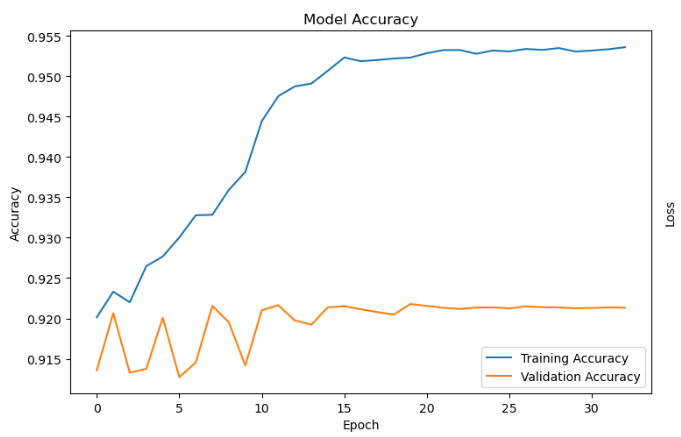
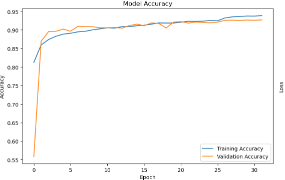
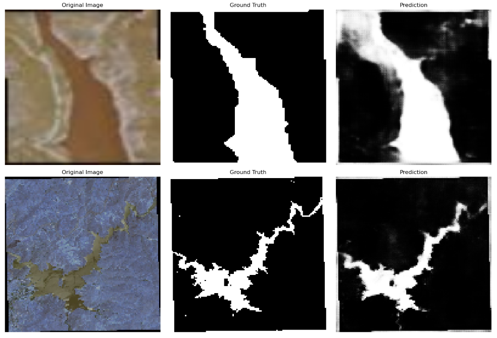
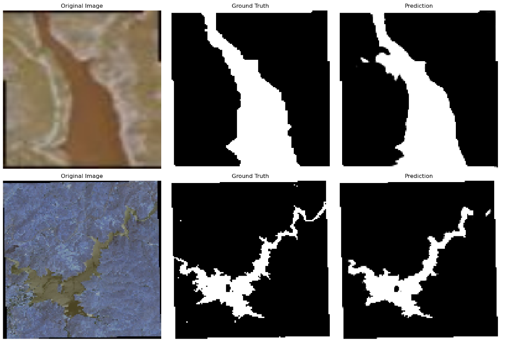

# Satellite Water Body Segmentation Using U-Net and U-Net++

## Overview

This project focuses on the semantic segmentation of water bodies from satellite imagery using deep learning techniques. The objective is to identify and segment water regions from satellite images and compare the performance of two popular segmentation architectures: **U-Net** and **U-Net++**.

The models were trained and evaluated on a publicly available satellite imagery dataset, and their performance was compared using segmentation metrics such as Precision, Recall, Mean IoU, and Accuracy.

---

## Dataset

Dataset used:

- Satellite Images of Water Bodies Dataset
- Source: https://www.kaggle.com/datasets/franciscoescobar/satellite-images-of-water-bodies

### Dataset Structure

```
Water Bodies Dataset/
├── Images/
│   ├── image1.jpg
│   ├── image2.jpg
│   └── ...
└── Masks/
    ├── image1.jpg
    ├── image2.jpg
    └── ...
```

### Preprocessing

- Images resized to **128 × 128**
- Pixel values normalized to range **[0,1]**
- Masks converted to binary format
- Dataset split into training and validation sets

---

## Models Implemented

### U-Net

U-Net is a convolutional neural network architecture designed for image segmentation. It consists of:

- Encoder path for feature extraction
- Decoder path for localization
- Skip connections to preserve spatial information

### U-Net++

U-Net++ is an improved version of U-Net that introduces:

- Nested skip connections
- Dense feature aggregation
- Better feature fusion between encoder and decoder layers

These enhancements help improve segmentation performance and boundary detection.

---

## Training Results

| Model | Precision | Recall | Mean IoU | Accuracy |
|---------|---------:|---------:|---------:|---------:|
| U-Net | 0.9327 | 0.9126 | 0.3907 | 0.9540 |
| U-Net++ | 0.9079 | 0.8811 | 0.7222 | 0.9380 |

---

## Validation Results

| Model | Precision | Recall | Mean IoU | Accuracy |
|---------|---------:|---------:|---------:|---------:|
| U-Net | 0.8820 | 0.8485 | 0.4476 | 0.9213 |
| U-Net++ | 0.8868 | 0.8651 | 0.7724 | 0.9271 |

---

## Accuracy Curves

### U-Net Accuracy



### U-Net++ Accuracy



---

## Sample Segmentation Results

### U-Net Predictions

The following examples show the original satellite image, corresponding ground truth mask, and the mask predicted by the U-Net model.



### U-Net++ Predictions

The following examples show the original satellite image, corresponding ground truth mask, and the mask predicted by the U-Net++ model.



---

## Analysis

Both U-Net and U-Net++ successfully segmented water bodies from satellite imagery.

While U-Net achieved a higher training accuracy of 95.40%, U-Net++ achieved substantially higher Mean IoU scores on both the training and validation datasets. The validation Mean IoU improved from 0.4476 for U-Net to 0.7724 for U-Net++, indicating a much stronger overlap between the predicted masks and the ground truth masks.

The training and validation accuracy curves show that U-Net++ maintained more consistent performance throughout training, suggesting better generalization on unseen data.

Visual inspection of the segmentation results further confirms that U-Net++ produced masks that more closely matched the actual shapes and boundaries of water bodies.

Based on both the quantitative metrics and qualitative results, U-Net++ outperformed U-Net for satellite water body segmentation in this study.

---

## Requirements

Install the required dependencies using:

```bash
pip install tensorflow numpy opencv-python matplotlib scikit-learn
```

Or use:

```bash
pip install -r requirements.txt
```

---

## Project Files

```
├── README.md
├── requirements.txt
├── Water_body-MAIN-Unet.ipynb
├── Water_body-MAIN_Unet_Plus_plus.ipynb
├── images/
|   ├── unet_predictions.png
|   ├── unetpp_predictions.png
│   ├── unet_accuracy.png
│   └── unetpp_accuracy.png
```

---

## Running the Project

1. Download the dataset from Kaggle.
2. Place the dataset in the project directory.
3. Ensure the folder structure matches the format shown above.
4. Open the notebooks.
5. Run all cells to train or evaluate the models.

---

## Note

The trained model weight files are not included in this repository because they exceed GitHub's file size limitations. The corresponding saved model files are required for inference and reproducing the reported results.

---

## Conclusion

This project demonstrates the effectiveness of deep learning-based semantic segmentation for identifying water bodies in satellite imagery. Both U-Net and U-Net++ achieved strong performance; however, U-Net++ provided substantially better Mean IoU and overall segmentation quality, making it the preferred architecture for this task.
